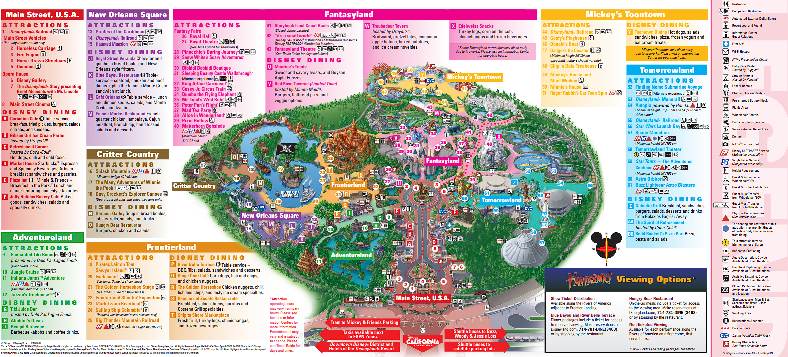
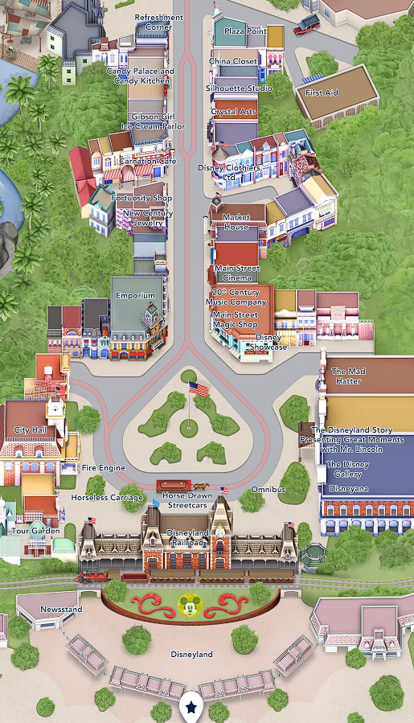
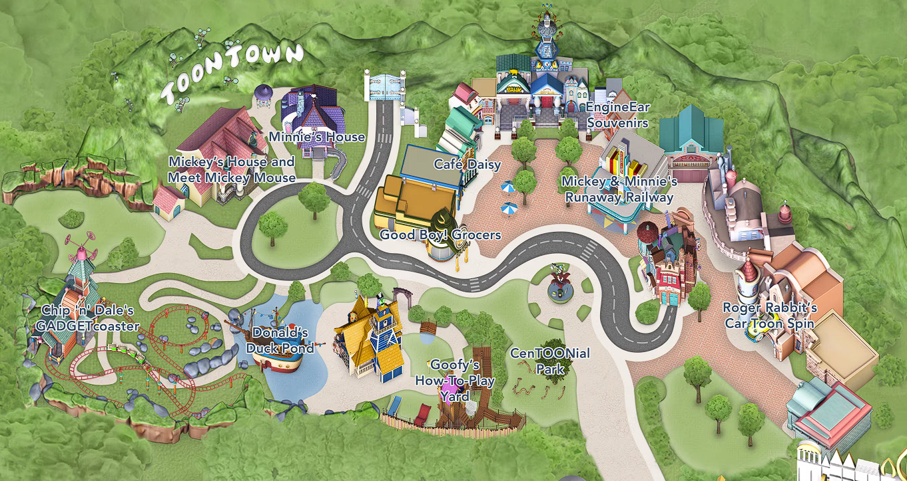
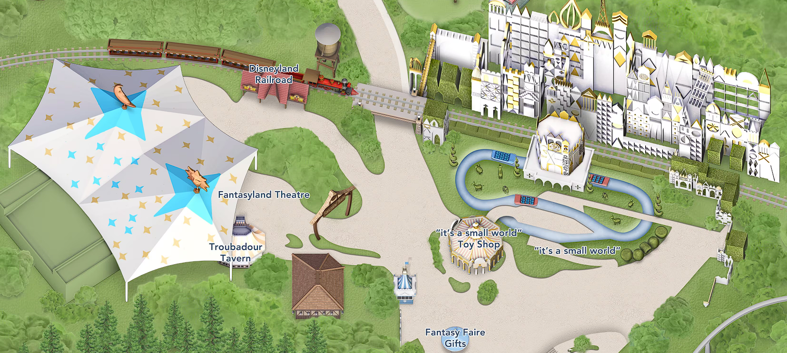
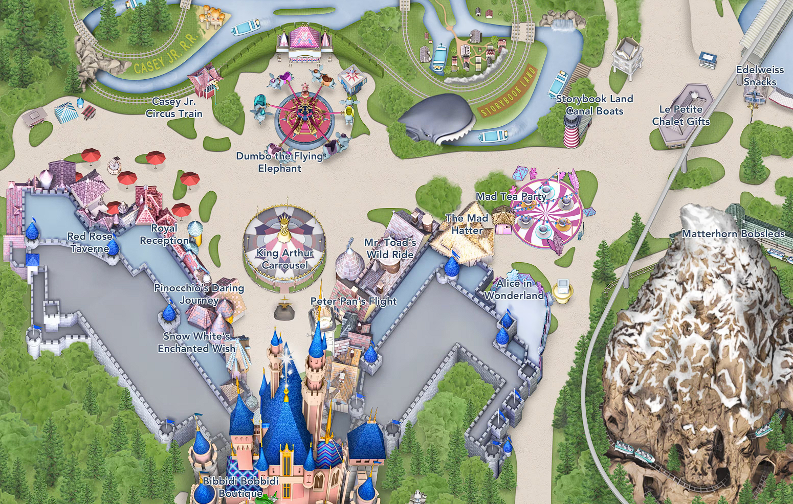
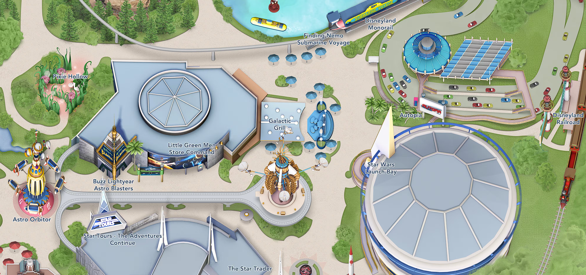
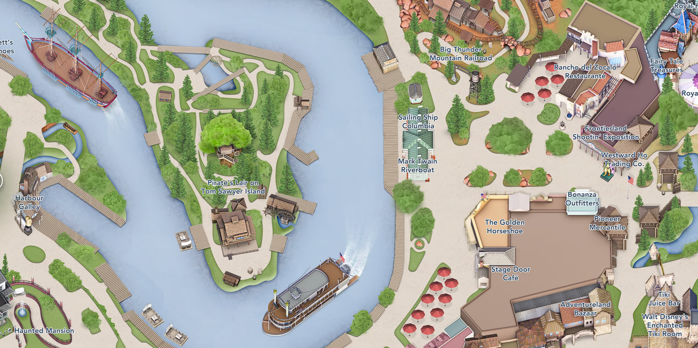
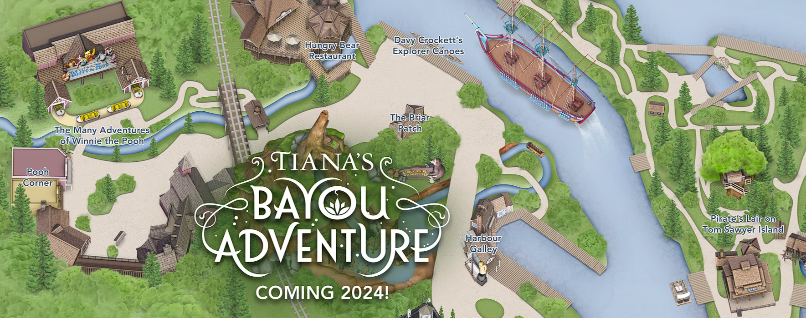

# Disneyland November 2023 Trip Plan

## Map

## Optimal Route

### Main Street

### Toontown

### Smallworld

### Fantasyland

### Tomorrowland

### Adventureland

### Frontierland

### New Orleans Square & Critter Country

### Galaxy's Edge (Star Wars)

## Key Events

5:15 PM - ["it's a small world" Holiday Lighting](https://disneyland.disney.go.com/entertainment/disneyland/its-a-small-world-holiday-lighting/)

6:30 PM - [A Christmas Fantasy Parade](https://disneyland.disney.go.com/entertainment/disneyland/christmas-fantasy-parade/)

7:30 PM - [Wintertime Enchantment at Sleeping Beauty's Winter Castle](https://disneyland.disney.go.com/entertainment/disneyland/wintertime-enchantment-sleeping-beauty-castle/)

9:30 PM - [Believe... In Holiday Magic Fireworks Spectacular](https://disneyland.disney.go.com/entertainment/disneyland/believe-in-holiday-magic-fireworks/)

## Food

Link to Disneyland food page: <https://disneyland.disney.go.com/dining/disneyland/#/sort=location/>
